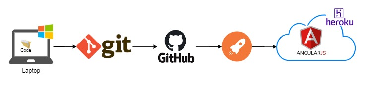

# Angular-TourOfHeroes-Front
Tour of Hero --- Angular + Node js

* [Angular Basic Tutorial](https://angular.io/tutorial) 


## App Deploy in Heroku

https://toh-front-app.herokuapp.com/

>The deploy is automatic from a pipeline.

### Flow of Deploy




-----------------------
## Initial Configuration [Local]

1. Modify the `src/environments/environment.ts` with this:
```
  URI_BACK: "your route for API Back"
  // example: URI_BACK: "https://toh-back-api.herokuapp.com/api/v1/hero"
  // example: URI_BACK: "http://localhost:3000/api/v1/hero"
```

-----------------------
## API Execution [Local]
1. Execute into the API
    ```
    npm install
    ```
2. Next, execute
    ```
    ng serve
    ```
3. Open [http://localhost:4200/](http://localhost:4200/) in you browser.


## Bugs

In case of this error: 

```
Could not find module "@angular-devkit/build-angular" from "/home/Projects/myProjectName".
Error: Could not find module "@angular-devkit/build-angular" from "/home/Projects/myProjectName".
    at Object.resolve (/home/Projects/myProjectName/node_modules/@angular-devkit/core/node/resolve.js:141:11)
    at Observable.rxjs_1.Observable [as _subscribe] (/home/Projects/myProjectName/node_modules/@angular-devkit/architect/src/architect.js:132:40)
``` 

then execute the command `npm uninstall @angular-devkit/build-angular` Next, execute the command `npm install @angular-devkit/build-angular@0.13.0` for install the version corresponding.


